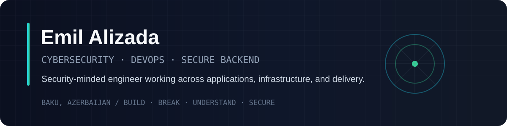

  

  <a href="mailto:alizadaemil404@gmail.com"><strong>Email</strong></a>
  ·
  <a href="https://github.com/EmilAlizada"><strong>GitHub</strong></a>

---

## About

I’m an Information Security graduate focused on the intersection of **cybersecurity, DevOps, and secure backend engineering**.

My hands-on experience spans authorized penetration testing, vulnerability assessment, containerized environments, CI/CD, cloud and Kubernetes fundamentals, and backend development with Python, Django, and PostgreSQL.

I’m especially interested in building systems that are **secure by design**, observable in production, and maintainable over time.

---

## Core Focus

<table>
  <tr>
    <td width="33%" valign="top">
      <h3>Security</h3>
      
Penetration testing, web application security, vulnerability assessment, red teaming, vulnerability reporting.

    </td>
    <td width="33%" valign="top">
      <h3>Infrastructure</h3>
      
Linux, Docker, Kubernetes, CI/CD, cloud, monitoring, logging, Infrastructure as Code.

    </td>
    <td width="33%" valign="top">
      <h3>Backend</h3>
      
Python, Django, PostgreSQL, Git, backend engineering and secure web development.

    </td>
  </tr>
</table>

---

## Experience

### Cybersecurity Intern · CyberON
**2026 · Baku, Azerbaijan**

- Performed authorized manual penetration testing on web applications and systems.
- Identified and reported security vulnerabilities.
- Participated in red-team style testing using both manual and automated techniques.

### DevOps Intern · Ordulu Teknoloji A.Ş.
**2025–2026 · Baku, Azerbaijan**

- Worked with containerization and CI/CD workflows.
- Applied Infrastructure as Code practices.
- Configured monitoring and logging in practical simulations.
- Gained hands-on exposure to cloud platforms and Kubernetes.

### Backend Developer Intern · Baku Design Academy
**2025 · Baku, Azerbaijan**

- Developed a web application using Python and Django.
- Worked with PostgreSQL and backend functionality.
- Participated in the full development lifecycle of the project.

---

## Technology Stack

**Security**  
`Linux` `Penetration Testing` `Web Application Security` `Vulnerability Assessment` `Red Teaming`

**Infrastructure**  
`Docker` `Kubernetes` `CI/CD` `Cloud` `Monitoring` `Logging` `Infrastructure as Code`

**Backend**  
`Python` `Django` `PostgreSQL` `Git`

---

## Selected Work

Four flagship projects cover the same three areas I want my profile to communicate: **security, infrastructure, and backend engineering**.

| Project | Focus | Main |
|---|---|---|
| [**DevSecOps Pipeline**](https://github.com/EmilAlizada/devsecops-pipeline) | CI/CD, Docker hardening, SAST, dependency auditing, Trivy |  |
| [**Secure Django API**](https://github.com/EmilAlizada/secure-django-api) | JWT, owner-scoped authorization, PostgreSQL, throttling, API security |  |
| [**Kubernetes Security Lab**](https://github.com/EmilAlizada/kubernetes-security-lab) | Pod Security, non-root workloads, NetworkPolicy, policy regression tests |  |
| [**Python Security Toolkit**](https://github.com/EmilAlizada/python-security-toolkit) | File integrity, hashing, HTTP headers, IOC extraction, log analysis |  |

The goal is **clear documentation, architecture decisions, reproducible setup, and security reasoning** rather than repository quantity.

---

## Education

**B.Sc. in Information Security**  
Azerbaijan Technical University · 2022–2026

Coursework included offensive and defensive security, penetration testing, malware analysis, digital forensics, web and database security, secure programming, cryptography, networking, cloud security, operating systems, ICS security, mobile and wireless security, and information security management.

---

## Languages

- Azerbaijani — native
- Turkish — C1
- English — B2/C1 across skills
- German — A1

---

## Current Direction

~~~text
Security Engineering
DevSecOps
Cloud Security
Infrastructure Automation
Secure Software Architecture
~~~

> Certifications will be added here only after they are earned and verifiable.

---

  <strong>Build · Break · Understand · Secure</strong>

